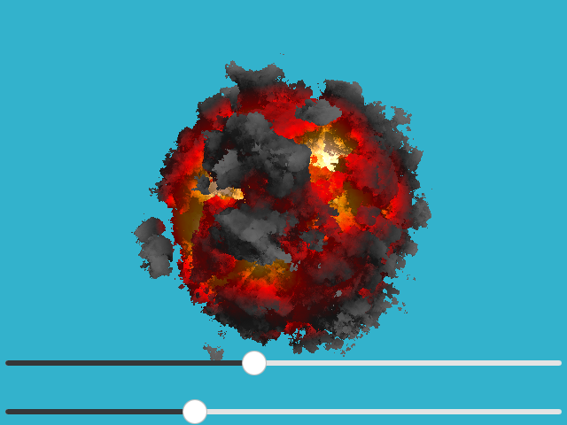
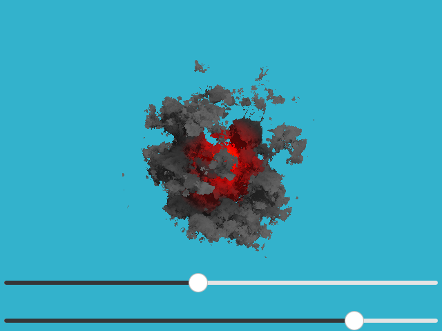
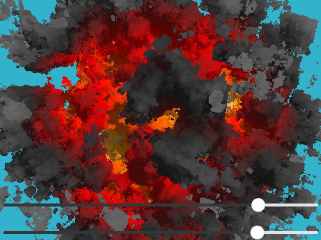
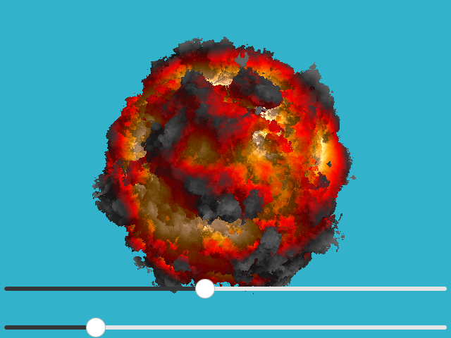

# qkaboom

The main idiea is from  https://github.com/ssloy/tinykaboom, and implement with qt qml's shadereffect.This project is distributed under the [DO WHAT THE FUCK YOU WANT TO PUBLIC LICENSE](https://en.wikipedia.org/wiki/WTFPL).

screen shot: 

